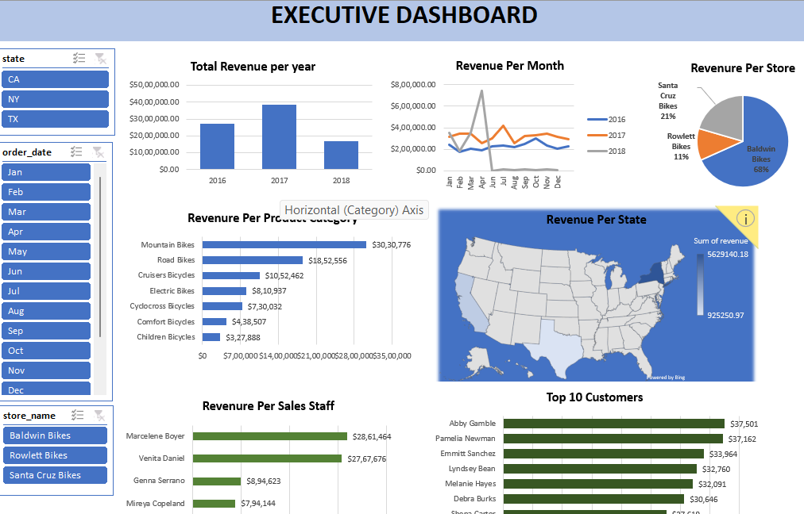

# Comprehensive Sales Analytics for Bike Retail

**Project Date:** October 2024  
**Technologies Used:** SQL, Excel  

This project provides a comprehensive analysis and visualization of sales for a bike retail store.

## Project Highlights
- **Data Cleaning and Preparation:** Consolidated raw SQL data with joins to organize key metrics.
- **Dashboard Development:** Developed an Excel dashboard for quick, actionable insights on revenue trends.

## Project Walkthrough
1. **Data Preparation** - Joined tables in SQL to clean and organize raw data.
2. **Data Import to Excel** - Imported consolidated data to Excel for analysis.
3. **Dashboard Creation** - Created visualizations to highlight revenue trends and KPIs.

## Key Insights
- Identified revenue patterns and customer purchase trends for decision-making.

## Screenshots

